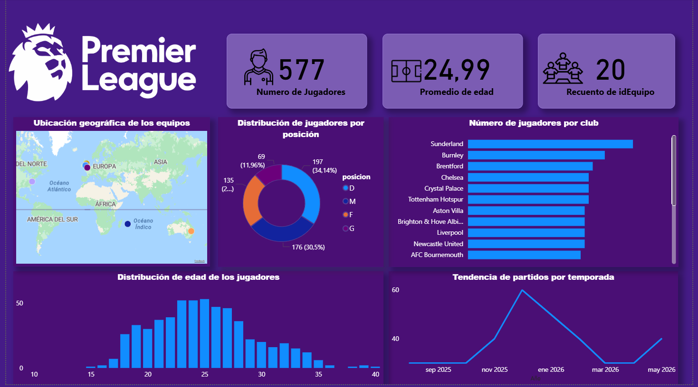
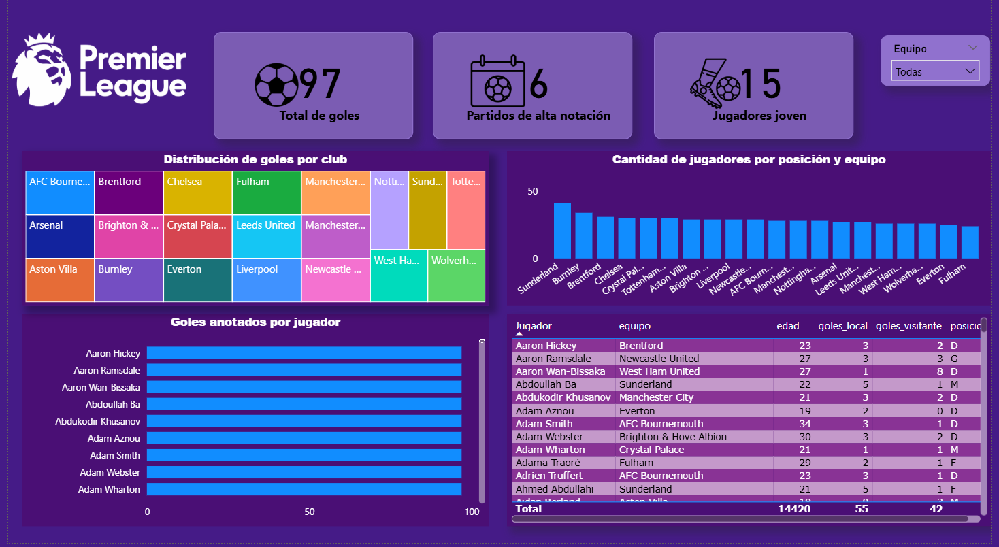

# ⚽ Premier League – Data Analysis Dashboard (Power BI)

## 📌 Descripción del Proyecto

Este proyecto consiste en el análisis exploratorio de datos de la Premier League mediante la construcción de un dashboard interactivo en Power BI.

El objetivo principal fue analizar el rendimiento ofensivo de los equipos, la composición de las plantillas y la distribución de edades de los jugadores, utilizando técnicas de transformación de datos y modelado con DAX.

---

## 🎯 Objetivos del análisis

- Evaluar la producción ofensiva por equipo y jugador.
- Analizar la distribución de jugadores por posición.
- Identificar el rango de edad predominante en la liga.
- Examinar la evolución de partidos disputados por mes.
- Detectar partidos con alta anotación.

---

## 🛠 Herramientas utilizadas

- **Power BI**
- Power Query (ETL)
- DAX (Data Analysis Expressions)
- Excel / CSV
- Git & GitHub

---

## 🔄 Proceso de desarrollo

### 1️⃣ Limpieza y Transformación de Datos
- Normalización de nombres de columnas.
- Revisión y tratamiento de valores nulos.
- Ajuste de tipos de datos.
- Creación de columnas calculadas.

### 2️⃣ Modelado de Datos
- Definición de relaciones entre tablas.
- Optimización del modelo para análisis eficiente.

### 3️⃣ Creación de Métricas en DAX
Se desarrollaron medidas como:

- `Total Goles`
- `Promedio de Edad`
- `Partidos con Alta Anotación`
- `Recuento de Jugadores por Posición`

### 4️⃣ Visualización
Se diseñaron dashboards enfocados en:

- KPIs principales
- Ranking de goleadores
- Producción ofensiva por club
- Distribución etaria
- Composición de plantilla por equipo

---

## 📊 Principales Insights

- La mayor concentración de jugadores se encuentra entre los 22 y 27 años.
- La producción ofensiva se distribuye de forma relativamente equilibrada entre los equipos.
- Se identificaron partidos con alta anotación que representan picos de actividad ofensiva.
- Existen diferencias en la composición de plantilla según el club.

---

## 📷 Vista del Dashboard





---

## 📂 Estructura del repositorio

```
/data → Dataset utilizado  
/images → Capturas del dashboard  
/dashboard → Archivo Power BI (.pbix)  
README.md
```

---

## 🚀 Conclusión

Este proyecto permitió aplicar conocimientos de:

- Limpieza y transformación de datos  
- Modelado analítico  
- Creación de métricas en DAX  
- Storytelling con datos  

Refuerza mis habilidades como practicante en análisis de datos, enfocándome en la interpretación y visualización de información para la toma de decisiones.

---

## 👤 Autor

**Ammy**  
Data Analyst en formación  
Interesado en análisis de datos, visualización y modelado analítico.
